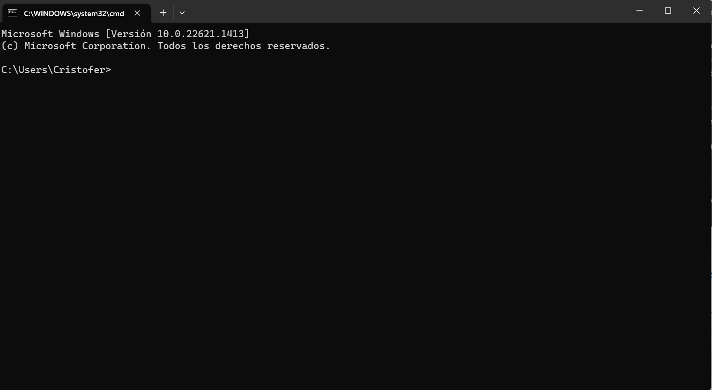

## Univeridad Mexiquense del Bicentenario
## Unidad de estudios superiores San José Del Rincón
## **PRACTICAS 1º PARCIAL.**
### **ASIGNATURA:** Programación Orinetada a Objetos
### **DOCENTE:** I.S.C Eduardo Becerril Romero.
### **ALUMNO:** Cristofer Piña Rodríguez.
### **SEMESTE:** 2º  
### **GRUPO:** 13SC121

# **Introducción**

C++ es uno de los leguajes de programacion más populares y utilizados en el mundo de la informática y la programación. Con él, se pueden desarrollar programas de todo tipo, desde aplicaciones de escritorio hasta sistemas operativos.

En este proyecto, se presentan 5 programas desarrollados en C++, cada uno de los cuales está compuesto por una descripción del código, el propio código fuente, una explicación detallada del mismo bloque por bloque, y finalmente, su compilado en el cmd de Windows.

Cada uno de estos programas es un ejemplo práctico que permite comprender mejor cómo funciona el lenguaje C++ y cómo aplicarlo en situaciones concretas.

# **Pasos para ejecutar un programa en c++**

1. Ya terminado nuestro programa ingresamos al cmd de windows (windows + r) y escribimos en el ejecutador **cmd**


2. Se nos abrira el simbolo del sistema.



3. En el ingresaremos el directorio donde se aloja nuestro archivo con extención **.cpp** siguiendo la sintaxis:

```cmd
cd desktop/carpeta_1/carpeta_1_1/carpeta_1_1_1/
```

4. devemos de convertir nuestro **archivo.cpp** a **archivo.o** siquiendo el siguente comando:

```cmd
g++ -c nombre_del_archivo.cpp -o nombre_del_archivo.o
```

5. En este momento se creará un archivo con entención **.o** ; ahora devemos convertir el archivo a uno con extención **.exe** con el siguente comando:

```cmd
g++ nombre_del_archivo.o -o nombre_del_archivo.exe
```

6. Si ingesamos los comandos correctamente se abrá creado un archivo con extención **.exe**; por lo que solo nos queda ejecutar el programa usando el siguente comando:

```cpp
nombre_del_archivo.exe
```
- Quedando las comandos aplicados de la siguente manera:


# **Programa 1: Productos**
## **Descripción:** 

Este programa tiene el proposito  que tiene como objetivo mostrar una lista de productos y sus precios, y permitir al usuario ingresar un número correspondiente al producto para obtener su precio.

## **Codigo:**

 ```cpp
#include <iostream>
 
using namespace std;

int main(){

    char productos [5][10] ={
        {'S','A','B','R','I','T','A','S'},
        {'T','A','M','A','R','I','N','D','O','S'},
        {'N','A','R','A','N','J','A','S'},
        {'F','A','B','U','L','O','S','O'},
        {'J','A','B','O','N',' ','Z','O','T','E'},
    };

    float precios [5] = {
        16.f,
        18.f,
        17.6f,
        13.9f,
        14.f,
    };

for (size_t i = 0; i < 5; i++)
{
    cout <<i<<")";
    for (size_t j = 0; j < 10; j++)
    {
        if (productos[i][j] == '\0')
        break;
        cout << productos [i][j];
    }
            cout << endl;
        }   
    unsigned int numero; 
    cout << "Bienvenido! selecciona un numero correspondiente al producto para que puedas ver su precio: ";
    cin >> numero;

    if (numero > 4)
    {
        cout << "Producto fuera de stock, intentalo nuevamente" << endl;
        
        return 1;
    }
    {
        cout << "El precio del producto es: ";
        cout << presios [numero] << endl;

        return 0;

    }
    
}
```
## **Explicacion:**

1. Estas dos líneas de código importan la biblioteca ``<iostream>`` y el espacio de nombres ``std`` para que puedan usarse en el programa.
```cpp
#include <iostream>
using namespace std;
```

2. Esta línea de código inicia la función principal del programa.
```cpp
int main(){
```

3. Esta matriz de caracteres llamada "productos" contiene los nombres de los cinco productos en filas de 10 caracteres, usando ``char`` para que pueda reconocer la cantidad de caracteres requeridos.
```cpp
char productos [5][10] ={
    {'S','A','B','R','I','T','A','S'},
    {'T','A','M','A','R','I','N','D','O','S'},
    {'N','A','R','A','N','J','A','S'},
    {'F','A','B','U','L','O','S','O'},
    {'J','A','B','O','N',' ','Z','O','T','E'},
};
```

4. Esta matriz de flotantes llamada "precios" contiene los precios correspondientes a los cinco productos en el mismo orden que aparecen en la matriz "productos".
```cpp
float precios [5] = {
    16.f,
    18.f,
    17.6f,
    13.9f,
    14.f,
};
```

5. Este bucle ``for`` anidado recorre la matriz "productos" y muestra el índice y el nombre de cada producto . El primer bucle ``for`` ejecuta a través de cada fila de la matriz y el segundo bucle ``for`` ejecuta a través de cada elemento en cada fila. El segundo bucle ``for`` termina cuando encuentra un carácter nulo ``'\0'``, lo que significa que ha llegado al final del nombre del producto.

```cpp
for (size_t i = 0; i < 5; i++)
{
    cout <<i<<")";
    for (size_t j = 0; j < 10; j++)
    {
        if (productos[i][j] == '\0')
        break;
        cout << productos [i][j];
    }
    cout << endl;
}
```
6. Estas líneas de código piden al usuario que ingrese un número correspondiente al producto que desea verificar.
```cpp
unsigned int numero; 
cout << "Bienvenido! selecciona un numero correspondiente al producto para que puedas ver su precio: ";
cin >> numero;
```

7. Esta declaración condicional verifica si el número ingresado por el usuario está fuera del rango de índices de la matriz "presios" y muestra un mensaje de error si es así. Si el número es válido, el programa continúa.
```cpp
if (numero > 4)
{
    cout << "Producto fuera de stock, intentalo nuevamente" << endl;
    return 1;
}
```
8. Este bloque de código muestra el precio del producto correspondiente y devuelve un valor entero para indicar si se ha completado correctamente
```cpp
{
    cout << "El precio del producto es: ";
    cout << presios [numero] << endl;
    return 0;
}
```
## **Resultado:**

- Resultado de producto dentro de stock:

- Resultado del producto fuera del stock:


# **Programa 2: Automoviles**
##  **Descripción:**

Este programa tiene como objetivo encontrar el modelo más reciente y el modelo más antiguo de una lista de cinco marcas de automóviles y sus respectivos modelos.

## **Codigo:**
```cpp
#include <iostream>

using namespace std;

int main (){
    char autos [5][10] = {
        {'M','E','R','C','E','D','E','S'},
        {'N','I','S','S','A','N'},
        {'J','E','E','P'},
        {'F','O','R','D'},
        {'K','I','A'},
    };

    float modelo [5]= {
        2022.f,
        1987.f,
        2004.f,
        2020.f,
        2000.f,
    };


float modelo_max = modelo[0];
float modelo_min = modelo[0];
for (int i = 1; i < 5; i++) {
    if (modelo[i] > modelo_max) {
        modelo_max = modelo[i];
    }
    if (modelo[i] < modelo_min) {
        modelo_min = modelo[i];
    }
}


char auto_mas_reciente[10];
char auto_mas_antiguo[10];
for (int i = 0; i < 5; i++) {
    if (modelo[i] == modelo_max) {
        for (int j = 0; j < 10; j++) {
            auto_mas_reciente[j] = autos[i][j];
        }
    }
    if (modelo[i] == modelo_min) {
        for (int j = 0; j < 10; j++) {
            auto_mas_antiguo[j] = autos[i][j];
        }
    }
}


cout << "Auto mas reciente: " << auto_mas_reciente << " " << modelo_max << endl;
cout << "Auto mas antiguo: " << auto_mas_antiguo << " " << modelo_min <<endl;

return 0;

}
```

## **Explicacion:**

1. Estas dos líneas de código importan la biblioteca ``<iostream>`` y el espacio de nombres ``std`` para que puedan usarse en el programa.
```cpp
#include <iostream>
using namespace std;
```

2. Esta línea de código inicia la función principal del programa.
```cpp
int main(){
```

3. Este arreglo tiene 5 filas y 10 columnas y se utiliza para almacenar el nombre de las marcas de automóviles.
```cpp
char autos [5][10] = {
    {'M','E','R','C','E','D','E','S'},
    {'N','I','S','S','A','N'},
    {'J','E','E','P'},
    {'F','O','R','D'},
    {'K','I','A'},
};
```

4. En esta matriz de código, se declara y se inicializa un arreglo unidimensional de tipo ``float`` llamado modelo. Este arreglo tiene 5 elementos y se utiliza para almacenar el modelo
```cpp
float modelo [5]= {
    2022.f,
    1987.f,
    2004.f,
    2020.f,
    2000.f,
};
```

5.En este bloque de código se encuentran dos variables ``float`` que inicialmente toman el valor del primer elemento del arreglo modelo. A continuación, se utiliza un ciclo ``for`` para recorrer todos los elementos del arreglo modelo a partir del segundo elemento y compararlos con el valor actual de **modelo_max** y **modelo_min**.
```cpp
float modelo_max = modelo[0];
float modelo_min = modelo[0];
for (int i = 1; i < 5; i++) {
    if (modelo[i] > modelo_max) {
        modelo_max = modelo[i];
    }
    if (modelo[i] < modelo_min) {
        modelo_min = modelo[i];
    }
}
```

6. En este bloque de código se declaran dos variables de tipo char llamadas auto_mas_reciente y auto_mas_antiguo, ambas con 10 elementos
```cpp
char auto_mas_reciente[10];
char auto_mas_antiguo[10];
for (int i = 0; i < 5; i++) {
    if (modelo[i] == modelo_max) {
        for (int j = 0; j < 10; j++) {
            auto_mas_reciente[j] = autos[i][j];
        }
    }
    if (modelo[i] == modelo_min) {
        for (int j = 0; j < 10; j++) {
            auto_mas_antiguo[j] = autos[i][j];
        }
    }
}
```

7. Este bloque de código utiliza la función cout de la biblioteca ``<iostream>`` para imprimir en pantalla dos líneas de texto que muestran los autos más reciente y antiguo junto con su modelo y devuelve un valor entero para indicar si se ha completado correctamente.
```cpp
cout << "Auto mas reciente: " << auto_mas_reciente << " " << modelo_max << endl;
cout << "Auto mas antiguo: " << auto_mas_antiguo << " " << modelo_min <<endl;

return 0;
}
```

## **Resultado:**


# **Programa 3: Playlist**
## **Descripción:**

El propósito de este programa es mostrar una lista de reproducción de canciones, junto con el artista y la duración de cada canción en segundos dando tambien la duración final de la lista de reproducción.

## **Codigo:**

```cpp
#include <iostream>

using namespace std;

int main(){

    char canciones [10][18] ={
        {'G','o','o','d',' ','4',' ','u'},
        {'T','h','a','n','k',' ','u',' ','n','e','x','t'},
        {'M','a','l','a','m','e','n','t','e'},
        {'S','a','v','e',' ','y','o','u','r',' ','t','e','a','r','s'},
        {'O','j','i','t','o','s',' ','l','i','n','d','o','s'},
        {'L','e','v','i','a','t','i','n','g'},
        {'H','a','p','p','i','e','r',' ','T','h','a','n',' ','E','v','e','r'},
        {'D','e','s','v','e','l','a','d','o'},
        {'C','o','m','o',' ','l','a',' ','f','l','o','r'},
        {'S','a','n',' ','l','u','c','a','s'},
    };

    char artistas [10][18] ={
        {'O','l','i','v','i','a',' ','R','o','d','r','i','g','o'},
        {'A','r','i','a','n','a',' ','G','r','a','n','d','e'},
        {'R','o','s','a','l','i','a'},
        {'T','h','e',' ','W','e','e','k','n','d'},
        {'B','a','d',' ','B','u','n','n','y'},
        {'D','u','a',' ','L','i','p','a'},
        {'B','i','l','l','i','e',' ','E','i','l','i','s','h'},
        {'B','o','b','b','y',' ','P','u','l','i','d','o'},
        {'S','e','l','e','n','a'},
        {'K','e','v','i','n',' ','K','a','a','r','l'},
    };

    float duracion [10] ={ 
        170.f,
        207.f,
        150.f,
        191.f,
        258.f,
        203.f,
        298.f,
        194.f,
        183.f,
        247.f,
    };

cout << "Lista de reproduccion:" << endl;
float duracion_total = 0;
for (int i = 0; i < 10; i++) 


float duracion_total = 0.0f;
for (int i = 0; i < 10; i++) {
    duracion_total += duracion[i];
}

cout << "Lista de reproduccion:\n";
for (int i = 0; i < 10; i++) {
    cout << canciones[i] << " - " << artistas[i] << " - " << duracion[i] << " segundos\n";
}

cout << "Duracion total: " << duracion_total << " segundos\n";

return 0;

}     
```

## **Explicación:**

1. Estas dos líneas de código importan la biblioteca ``<iostream>`` y el espacio de nombres ``std`` para que puedan usarse en el programa.
```cpp
#include <iostream>
using namespace std;
```

2. Esta línea de código inicia la función principal del programa.
```cpp
int main(){
```
3. Esta es una matriz bidimensional de caracteres que almacena el nombre de las canciones, usando ``char`` para que pueda reconocer la cantidad de caracteres requeridos..
```cpp
char canciones [10][18] ={
    {'G','o','o','d',' ','4',' ','u'},
    {'T','h','a','n','k',' ','u',' ','n','e','x','t'},
    {'M','a','l','a','m','e','n','t','e'},
    {'S','a','v','e',' ','y','o','u','r',' ','t','e','a','r','s'},
    {'O','j','i','t','o','s',' ','l','i','n','d','o','s'},
    {'L','e','v','i','a','t','i','n','g'},
    {'H','a','p','p','i','e','r',' ','T','h','a','n',' ','E','v','e','r'},
    {'D','e','s','v','e','l','a','d','o'},
    {'C','o','m','o',' ','l','a',' ','f','l','o','r'},
    {'S','a','n',' ','l','u','c','a','s'},
};
```

4. Esta es otra matriz bidimensional de caracteres que almacena el nombre del artista correspondiente a cada canción.
```cpp
char artistas [10][18] ={
    {'O','l','i','v','i','a',' ','R','o','d','r','i','g','o'},
    {'A','r','i','a','n','a',' ','G','r','a','n','d','e'},
    {'R','o','s','a','l','i','a'},
    {'T','h','e',' ','W','e','e','k','n','d'},
    {'B','a','d',' ','B','u','n','n','y'},
    {'D','u','a',' ','L','i','p','a'},
    {'B','i','l','l','i','e',' ','E','i','l','i','s','h'},
    {'B','o','b','b','y',' ','P','u','l','i','d','o'},
    {'S','e','l','e','n','a'},
    {'K','e','v','i','n',' ','K','a','a','r','l'},
};
```
5. Esta es una matriz unidimensional de números de punto flotante que almacena la duración de cada canción en segundos.
```cpp
float duracion [10] ={ 
    170.f,
    207.f,
    150.f,
    191.f,
    258.f,
    203.f,
    298.f,
    194.f,
    183.f,
    247.f,
};
```
6. Este bloque imprime en la consola un mensaje que indica que se va a mostrar la lista de reproducción. Luego se inicializa una variable ``duracion_total`` con un valor de cero. Luego, se utiliza un bucle ``for`` para recorrer el arreglo ``duracion`` e ir sumando los valores de cada elemento en la variable ``duracion_total``.
```cpp
cout << "Lista de reproduccion:" << endl;
float duracion_total = 0;
for (int i = 0; i < 10; i++) 


float duracion_total = 0.0f;
for (int i = 0; i < 10; i++) {
    duracion_total += duracion[i];
}
```

7. Este bloque imprime la lista de reproducción completa, utilizando un bucle for para recorrer los arreglos ``canciones``, ``artistas`` y ``duracion``. En cada iteración del bucle, se imprime el nombre de la canción, el nombre del artista y la duración en segundos.

```cpp
cout << "Lista de reproduccion:\n";
for (int i = 0; i < 10; i++) {
    cout << canciones[i] << " - " << artistas[i] << " - " << duracion[i] << " segundos\n";
}
```

8. Este bloque imprime la duración total de la lista de reproducción, que fue calculada en el cuarto bloque. Luego, se finaliza el programa con una instrucción ``return 0``;. Esto indica que el programa ha terminado exitosamente.
```cpp
cout << "Duracion total: " << duracion_total << " segundos\n";

return 0;
```


## **Resultado:**


# **Programa 4: Nombres iguales en directorio telefónico**
## **Descripción:**

Este programa busca coincidencias en una lista de nombres y números de teléfono. El usuario ingresa un criterio de búsqueda, que puede ser una parte del nombre, y el programa busca todos los nombres en la lista que contengan esa parte.

- **Codigo:**

```cpp
#include <iostream>

using namespace std;

int main (){
    char personas [10][18] ={
        {'M','o','n','i','c','a'},
        {'J','u','a','n',' ','P','a','b','l','o'},
        {'M','o','n','s','e','r','r','a','r'},
        {'J','u','a','n',' ','C','a','r','l','o','s'},
        {'O','m','a','r',' ','T','a','d','e','o'},
        {'O','m','a','r',' ','J','e','s','u','s'},
        {'Y','a','m','i','l','e','t'},
        {'Y','a','z','m','i','n'},
        {'E','d','u','a','r','d','o'},
        {'E','d','n','a',' ','S','a','r','a','h','i'},
    };
    char Numeros [10][11] ={
        {'5','5','4','0','9','3','6','8','0','3','\0'},
        {'5','5','6','2','9','1','4','8','9','8','\0'},
        {'7','1','2','1','8','3','9','8','8','4','\0'},
        {'7','2','2','7','9','5','3','8','0','3','\0'},
        {'7','2','2','2','9','8','2','3','1','0','\0'},
        {'5','5','5','0','6','3','2','1','0','1','\0'},
        {'5','6','8','1','8','9','6','7','0','9','\0'},
        {'5','5','9','1','7','7','8','7','8','3','\0'},
        {'7','1','2','1','9','3','6','9','0','5','\0'},
        {'7','2','2','8','9','7','4','4','2','9','\0'},
    };
    char busqueda[18];
    cout << "Ingrese el nombre: ";
    cin >> busqueda;

    int longitud_busqueda = 0;
    for(int i=0; busqueda[i]!='\0' && i<18; i++){
        longitud_busqueda++;
    }

    int coincidencias;
    for (int i = 0; i < 10; i++) {
        coincidencias = 0;
        for (int j = 0; j < longitud_busqueda; j++) {
            if (personas[i][j] == busqueda[j]) {
                coincidencias++;
            }
        }
        if (coincidencias == longitud_busqueda) {
            cout << personas[i] << ": " << Numeros[i] << endl;
        }
    }

    return 0;
}
```
## **Explicación:**

1. Estas dos líneas de código importan la biblioteca ``<iostream>`` y el espacio de nombres ``std`` para que puedan usarse en el programa.
```cpp
#include <iostream>
using namespace std;
```

2. Esta línea de código inicia la función principal del programa.
```cpp
int main(){
```

3. Esta es una matriz bidimensional de 10 filas y 18 columnas tiene la función de almacenar el nombre de las personas, usando ``char`` para que pueda reconocer la cantidad de caracteres requeridos.
```cpp
char personas [10][18] ={
        {'M','o','n','i','c','a'},
        {'J','u','a','n',' ','P','a','b','l','o'},
        {'M','o','n','s','e','r','r','a','r'},
        {'J','u','a','n',' ','C','a','r','l','o','s'},
        {'O','m','a','r',' ','T','a','d','e','o'},
        {'O','m','a','r',' ','J','e','s','u','s'},
        {'Y','a','m','i','l','e','t'},
        {'Y','a','z','m','i','n'},
        {'E','d','u','a','r','d','o'},
        {'E','d','n','a',' ','S','a','r','a','h','i'},
};
```

3. Esta es otra matriz bidimensional de 10 filas y 11 columnas tiene la función de almacenar el numero telefonico de las personas, usando ``char`` para que pueda reconocer la cantidad de caracteres requeridos.
```cpp
char Numeros [10][11] ={
        {'5','5','4','0','9','3','6','8','0','3','\0'},
        {'5','5','6','2','9','1','4','8','9','8','\0'},
        {'7','1','2','1','8','3','9','8','8','4','\0'},
        {'7','2','2','7','9','5','3','8','0','3','\0'},
        {'7','2','2','2','9','8','2','3','1','0','\0'},
        {'5','5','5','0','6','3','2','1','0','1','\0'},
        {'5','6','8','1','8','9','6','7','0','9','\0'},
        {'5','5','9','1','7','7','8','7','8','3','\0'},
        {'7','1','2','1','9','3','6','9','0','5','\0'},
        {'7','2','2','8','9','7','4','4','2','9','\0'},
};
```

4. Se declara una variable de cadena busqueda de tamaño 18 para almacenar el nombre que el usuario ingresará por consola. El programa luego muestra el mensaje "Ingrese el nombre: " para solicitar al usuario que ingrese un nombre.

```cpp
char busqueda[18];
cout << "Ingrese el nombre: ";
cin >> busqueda;
```

5. En este bloque de codigo se inicializa la variable ``longitud_busqueda`` como 0 y se itera sobre el arreglo ``busqueda`` hasta encontrar el caracter nulo ``'\0'`` o se llegue al límite de tamaño del arreglo (18). En cada iteración, se incrementa ``longitud_busqueda`` en 1

```cpp
int longitud_busqueda = 0;
for(int i=0; busqueda[i]!='\0' && i<18; i++){
    longitud_busqueda++;
}
```
6. En este bloque se declara una variable ``coincidencias`` como 0 para contar cuántos caracteres coinciden entre el nombre buscado y el nombre almacenado en la matriz de nombres ``personas``. Se utiliza un bucle a cada nombre almacenado en ``personas`` y luego inspecciona sobre cada caracter en ambos nombres para compararlos. Si un caracter coincide, se incrementa ``coincidencias ``en 1.

```cpp
int coincidencias;
for (int i = 0; i < 10; i++) {
    coincidencias = 0;
    for (int j = 0; j < longitud_busqueda; j++) {
        if (personas[i][j] == busqueda[j]) {
            coincidencias++;
        }
    }
```

7. En este bloque condiciona si el número de coincidencias entre los dos nombres es igual, significa que el nombre almacenado en ``personas`` coincide exactamente con la búsqueda. En ese caso, se imprime el nombre y el número de teléfono correspondiente almacenado en la matriz ``Numeros``.

```cpp
if (coincidencias == longitud_busqueda) {
    cout << personas[i] << ": " << Numeros[i] << endl;
}
```

8. En este bloque retorna el valor 0 para indicar que el programa ha finalizado con éxito.

```cpp
return 0;
```

## **Resultado:**


# **Programa 5: Calificaciones**

## **Descripción:**

Este programa almacena el nombre de 10 alumnos y sus calificaciones en dos arreglos diferentes y luego muestra en la consola los nombres y las calificaciones de los alumnos que han reprobado.

##  **Codigo:**

```cpp
#include <iostream>

using namespace std;

int main() {
    char alumnos[10][18] = {
        {'M', 'o', 'n', 'i', 'c', 'a', ' ', 'M', 'o', 'r', 'a'},
        {'J', 'u', 'a', 'n', ' ', 'P', 'e', 'r', 'e', 'z'},
        {'M', 'o', 'n', 's', 'e', 'r', 'r', 'a', 't', ' ', 'C', 'r', 'u', 'z'},
        {'J', 'u', 'a', 'n', ' ', 'C', 'a', 'r', 'm', 'o', 'n', 'a'},
        {'O', 'm', 'a', 'r', ' ', 'T', 'o', 'l', 'e', 'd', 'o'},
        {'O', 'm', 'a', 'r', ' ', 'd', 'e', ' ', 'J', 'e', 's', 'u', 's'},
        {'Y', 'a', 'm', 'i', 'l', 'e', 't', ' ', 'H', 'e', 'r', 'n', 'a', 'n', 'd', 'e', 'z'},
        {'Y', 'a', 'z', 'm', 'i', 'n', ' ', 'S', 'o', 't', 'o'},
        {'E', 'd', 'u', 'a', 'r', 'd', 'o', ' ', 'P', 'i', 'n', 'e', 'd', 'a'},
        {'E', 'd', 'n', 'a', ' ', 'S', 'a', 'r', 'a', 'h', 'i', ' ', 'M', 'i', 'n', 'e', 'r', 'o'}
    };

    float calificacion[10] = {
        95.f,
        27.f,
        50.f,
        91.f,
        58.f,
        03.f,
        98.f,
        94.f,
        83.f,
        47.f
    };

    cout << "Alumnos reprobados: " << endl;

    for (int i = 0; i < 10; i++) {
        if (calificacion[i] < 69) {
            cout << alumnos[i] << " con calificacion de: " << calificacion[i] << endl;
        }
    }

    return 0;
}
```
##  **Explicación:**

1. Estas dos líneas de código importan la biblioteca ``<iostream>`` y el espacio de nombres ``std`` para que puedan usarse en el programa.
```cpp
#include <iostream>
using namespace std;
```7

2. Esta línea de código inicia la función principal del programa.
```cpp
int main(){
```

3. Esta es una matriz bidimensional de caracteres llamada alumnos contiene 10 filas y 18 columnas, usando ``char`` para que pueda reconocer la cantidad de caracteres requeridos.
```cpp
 char alumnos[10][18] = {
        {'M', 'o', 'n', 'i', 'c', 'a', ' ', 'M', 'o', 'r', 'a'},
        {'J', 'u', 'a', 'n', ' ', 'P', 'e', 'r', 'e', 'z'},
        {'M', 'o', 'n', 's', 'e', 'r', 'r', 'a', 't', ' ', 'C', 'r', 'u', 'z'},
        {'J', 'u', 'a', 'n', ' ', 'C', 'a', 'r', 'm', 'o', 'n', 'a'},
        {'O', 'm', 'a', 'r', ' ', 'T', 'o', 'l', 'e', 'd', 'o'},
        {'O', 'm', 'a', 'r', ' ', 'd', 'e', ' ', 'J', 'e', 's', 'u', 's'},
        {'Y', 'a', 'm', 'i', 'l', 'e', 't', ' ', 'H', 'e', 'r', 'n', 'a', 'n', 'd', 'e', 'z'},
        {'Y', 'a', 'z', 'm', 'i', 'n', ' ', 'S', 'o', 't', 'o'},
        {'E', 'd', 'u', 'a', 'r', 'd', 'o', ' ', 'P', 'i', 'n', 'e', 'd', 'a'},
        {'E', 'd', 'n', 'a', ' ', 'S', 'a', 'r', 'a', 'h', 'i', ' ', 'M', 'i', 'n', 'e', 'r', 'o'}
    };
```

4. En esta matriz de código, se declara y se inicializa un arreglo unidimensional de tipo ``float`` llamado calificación. Este arreglo tiene 5 elementos.

```cpp
float calificacion[10] = {
        95.f,
        27.f,
        50.f,
        91.f,
        58.f,
        03.f,
        98.f,
        94.f,
        83.f,
        47.f
};
```

5. Este bloque de código utiliza la función cout de la biblioteca ``<iostream>`` para imprimir en pantalla una línea de texto que muestra el enabezado de **Alunmos reprobados**

```cpp
 cout << "Alumnos reprobados: " << endl;
 ```

6. En este bloque de codigo integra un ciclo for ``for`` para recorrer el arreglo calificacion y verificar si alguna de las calificaciones es menor a **69**; Si es así, se imprime el nombre del alumno y su calificación correspondiente en la consola mediante la función ``cout``.

```cpp

for (int i = 0; i < 10; i++) {
        if (calificacion[i] < 69) {
            cout << alumnos[i] << " con calificacion de: " << calificacion[i] << endl;
        }
    }
```

7. En este bloque se retorna el valor 0 para indicar que el programa se ejecutó sin errores.

```cpp
    return 0;
}

```

##  **Resultado:**


# **Conclución**
En conclusión, este proyecto de 5 programas realizados en C++ es una excelente herramienta para aprender y mejorar habilidades en programación en este lenguaje.

Estos programas son útiles ya que permiten aplicar los conceptos y técnicas de programación, comprender cómo funciona C++. Además, el hecho de contar con la explicación detallada del código, hace que sea más fácil entender cómo se han aplicado estos conceptos y técnicas.
